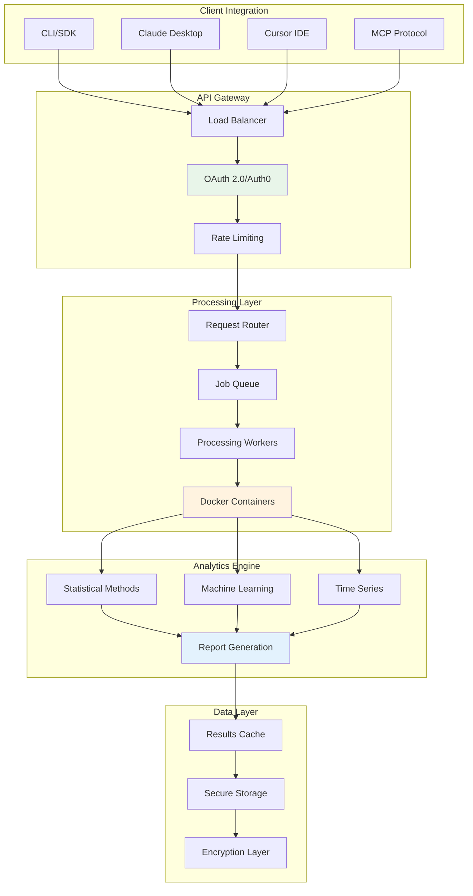

# MCP Analytics Suite

<div align="center">

[](https://mcpanalytics.ai)
[](https://mcpanalytics.ai/tools)
[](https://mcpanalytics.ai/terms)
[](https://mcpanalytics.ai/docs)
[](https://mcpanalytics.ai/oauth-setup)

**Every analysis starts with a question. We handle the rest.**

[🚀 Quick Start](#quick-start) • [🔄 How It Works](#how-it-works) • [🛠️ MCP Tools](#mcp-tools) • [🛡️ Security](#security--compliance) • [📖 Documentation](#documentation)

</div>

---

## The Formula

<div align="center">
  <h3>Question + Dataset = Analytics</h3>
  <p>Transform business questions into actionable insights through intelligent discovery</p>
</div>

## Overview

MCP Analytics Suite is an intelligent analytics platform that understands what you want to analyze and automatically selects the right approach. No statistics degree required—just describe your business question and let our AI-powered discovery handle the complexity.

### Why MCP Analytics?

- **Intelligent Discovery**: Automatically finds the right analytical approach
- **Complete Workflow**: From question to insight in one seamless flow
- **Zero Setup**: Cloud-based processing, works instantly
- **Enterprise Security**: OAuth2, encryption, isolated processing
- **Comprehensive Suite**: Full range of analytical capabilities
- **Interactive Reports**: Shareable visualizations with AI insights

## Quick Start

### Installation

##### For Claude Desktop

Add to your config file:
- **macOS**: `~/Library/Application Support/Claude/claude_desktop_config.json`
- **Windows**: `%APPDATA%\Claude\claude_desktop_config.json`

```json
{
  "mcpServers": {
    "mcp-analytics": {
      "command": "npx",
      "args": ["-y", "mcp-remote@latest", "https://api.mcpanalytics.ai/auth0"]
    }
  }
}
```

##### For Cursor

Add to `.cursor/config.json` in your project root:

```json
{
  "mcpServers": {
    "mcp-analytics": {
      "command": "npx",
      "args": ["-y", "mcp-remote@latest", "https://api.mcpanalytics.ai/auth0"]
    }
  }
}
```

##### For VS Code (Continue Extension)

Add to your Continue config at `~/.continue/config.json`:

```json
{
  "models": [{
    "provider": "anthropic",
    "model": "claude-3-5-sonnet",
    "mcpServers": {
      "mcp-analytics": {
        "command": "npx",
        "args": ["-y", "mcp-remote@latest", "https://api.mcpanalytics.ai/auth0"]
      }
    }
  }]
}
```

##### For Claude Code

Add to `claude_code_config.json`:

```json
{
  "mcpServers": {
    "mcp-analytics": {
      "command": "npx",
      "args": ["-y", "mcp-remote@latest", "https://api.mcpanalytics.ai/auth0"]
    }
  }
}
```

## How It Works

### The MCP Analytics Workflow

1. **Ask Your Question** - Describe what you want to analyze in natural language
2. **Intelligent Discovery** - `tools.discover` finds the right analytical approach
3. **Data Upload** - `datasets.upload` securely processes your data
4. **Automated Analysis** - `tools.run` executes with optimal configuration
5. **Interactive Results** - `reports.view` delivers shareable insights

```
User: "What drives our sales growth?"
MCP Analytics:
  → Discovers regression and correlation methods
  → Configures analysis for your data structure
  → Runs multiple analytical approaches
  → Returns comprehensive report with insights
```

## MCP Tools

The platform provides a complete suite of MCP tools for end-to-end analytics:

### Core Analytics Tools
- **`tools.discover`** - Natural language tool discovery
- **`tools.run`** - Automated analysis execution
- **`tools.info`** - Get tool documentation

### Data Management
- **`datasets.upload`** - Secure data upload with encryption
- **`datasets.list`** - Manage your datasets
- **`datasets.read`** - Access and preview data

### Reporting & Insights
- **`reports.view`** - Interactive visualization dashboard
- **`reports.search`** - Semantic search across analyses

### Platform Tools
- **`billing()`** - Usage and subscription management
- **`about()`** - Platform information and status
- **`manual()`** - Documentation access

## Features

### Natural Language Interface

Just describe what you need:

```
"What drives our revenue growth?"
"Find customer segments in our data"
"Forecast next quarter's sales"
"Did our marketing campaign work?"
```

### Comprehensive Analysis Suite

<table>
<tr>
<td width="50%">

**Statistical Methods**
- Regression Analysis
- Advanced Modeling
- Hypothesis Testing
- Survival Analysis
- Bayesian Methods

</td>
<td width="50%">

**Machine Learning**
- Ensemble Methods
- Boosting Algorithms
- Neural Networks
- Clustering
- Dimensionality Reduction

</td>
</tr>
<tr>
<td width="50%">

**Time Series**
- Forecasting
- Seasonal Analysis
- Trend Detection
- Multivariate Models
- Causal Analysis

</td>
<td width="50%">

**Business Analytics**
- Customer Analytics
- Market Analysis
- Pricing Models
- Predictive Analytics
- Experimental Design

</td>
</tr>
</table>

### Seamless Workflow


## Example Usage

### Basic Regression
```
User: "I have a CSV with house prices. Can you predict price based on size and location?"
Claude: [Runs linear regression, provides R², coefficients, and diagnostic plots]
```

### Customer Segmentation
```
User: "Segment my customers in sales_data.csv into meaningful groups"
Claude: [Performs k-means clustering, creates segment profiles with visualizations]
```

### Time Series Forecasting
```
User: "Forecast next quarter's revenue using our historical data"
Claude: [Applies ARIMA, generates predictions with confidence intervals]
```

## Security & Compliance

### Enterprise Security Features

- **Authentication**: OAuth2 via Auth0 with PKCE
- **Encryption**: TLS 1.3 for all data transfers
- **Processing**: Isolated Docker containers per analysis
- **Data Handling**: Ephemeral processing, no persistence
- **Access Control**: API key management with usage limits
- **Audit Trail**: Complete logging for compliance

### Privacy & Data Handling

- **Data Privacy**: Ephemeral processing, no data retention
- **User Rights**: Data deletion upon request
- **Secure Processing**: Isolated containers per analysis
- **Enterprise Options**: Contact us for compliance requirements

[**Read full security documentation →**](https://mcpanalytics.ai/security)

## Architecture



## Performance

- **Dataset Size**: Handles large datasets
- **Processing Time**: Fast cloud-based processing
- **Secure Infrastructure**: Isolated Docker containers
- **API Access**: RESTful API with authentication

## Getting Started

[**Visit our website for pricing and signup →**](https://mcpanalytics.ai)

## Documentation

- [**Quick Start Guide**](https://mcpanalytics.ai/docs/quickstart) - Get running in 30 seconds
- [**API Reference**](https://api.mcpanalytics.ai/docs) - Complete API documentation
- [**Platform Overview**](https://mcpanalytics.ai/tools) - How the platform works
- [**Tutorials**](https://mcpanalytics.ai/tutorials) - Step-by-step guides
- [**Examples**](https://mcpanalytics.ai/examples) - Real-world use cases
- [**Security**](https://mcpanalytics.ai/security) - Security & compliance details

## Support

- **Issues**: [GitHub Issues](https://github.com/embeddedlayers/mcp-analytics/issues)
- **Discord**: [Join our community](https://discord.gg/mcpanalytics)
- **Email**: support@mcpanalytics.ai
- **Docs**: [mcpanalytics.ai/docs](https://mcpanalytics.ai/docs)
- **Enterprise**: sales@mcpanalytics.ai

## Comparison with Other MCP Servers

| Feature | MCP Analytics | Google Analytics MCP | PostgreSQL MCP | Filesystem MCP |
|---------|--------------|---------------------|----------------|----------------|
| **Use Case** | Statistical Analysis | Web Metrics | Database Queries | File Access |
| **Setup Time** | 30 seconds | OAuth + Config | Connection string | Path config |
| **Data Sources** | Any CSV/JSON/URL | GA4 Only | PostgreSQL Only | Local files |
| **Analysis Tools** | Full Suite | GA4 Metrics | SQL Only | Read/Write |
| **Machine Learning** | ✅ Full Suite | ❌ | ❌ | ❌ |
| **Visualizations** | ✅ Interactive | ✅ Dashboards | ❌ | ❌ |
| **Shareable Reports** | ✅ | ❌ | ❌ | ❌ |

[**Detailed comparison →**](https://mcpanalytics.ai/comparisons)

## About MCP Analytics

MCP Analytics is built by a team of data scientists and engineers passionate about making advanced analytics accessible through AI. We're backed by enterprise customers across finance, healthcare, and e-commerce.

### Coming Soon

- **NPM Package**: Direct installation via `npm install @mcpanalytics/server`
- **Smithery Integration**: One-click install via Smithery CLI
- **MCP Registry**: Official listing in the MCP servers directory
- **More Tools**: Continuously expanding our analytics capabilities

## Development

### Testing Your Connection

```bash
# Test the MCP connection directly
npx -y mcp-remote@latest https://api.mcpanalytics.ai/auth0
```

### Environment Variables

```bash
# Optional: Set your API key for programmatic access
export MCP_ANALYTICS_API_KEY="your_api_key"

# Optional: Set custom endpoint (for enterprise customers)
export MCP_ANALYTICS_ENDPOINT="https://custom.mcpanalytics.ai"
```

### Local Development

For testing with local data:

```javascript
// Example: Testing with local CSV
const response = await mcp.call('tools/run', {
  name: 'linear_regression',
  arguments: {
    dataset: './data/sales.csv',
    target: 'revenue',
    features: ['marketing_spend', 'sales_calls']
  }
});
```

### Debugging

Enable debug logging:
```bash
export DEBUG=mcp:*
```

View logs in your IDE:
- **Claude Desktop**: Check developer console
- **Cursor**: View output panel
- **VS Code**: Check Continue extension logs

## Contributing

While the core server is proprietary, we welcome contributions to:

- Documentation improvements
- Example notebooks and use cases
- Bug reports and feature requests
- Community tools and integrations

See [CONTRIBUTING.md](CONTRIBUTING.md) for guidelines.

## License

Copyright © 2025 PeopleDrivenAI LLC. All Rights Reserved.

MCP Analytics is a product of PeopleDrivenAI LLC.

This is commercial software. Use of the MCP Analytics service is subject to our:
- [Terms of Service](https://mcpanalytics.ai/terms)
- [Privacy Policy](https://mcpanalytics.ai/privacy)
- [Acceptable Use Policy](https://mcpanalytics.ai/aup)

---

<div align="center">

**Ready to transform your data analysis workflow?**

[**Get Started Free**](https://mcpanalytics.ai/signup) | [**Read Docs**](https://mcpanalytics.ai/docs) | [**View Demo**](https://mcpanalytics.ai/demo)

Built by [MCP Analytics](https://mcpanalytics.ai) | Powered by R & Python

</div>