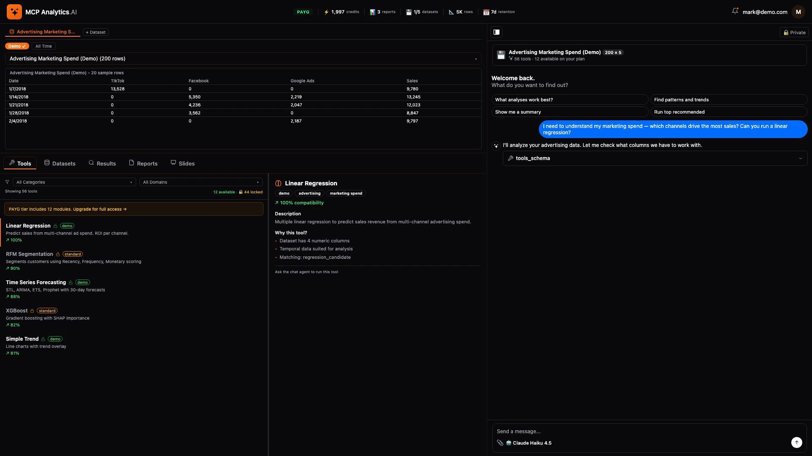
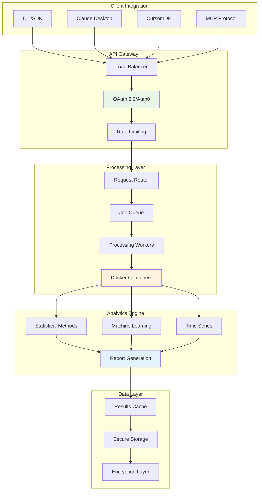

# MCP Analytics Suite

> ⚠️ **Beta — v2 rebuild in progress.** We're actively rebuilding the platform. Some features are incomplete or unstable right now. You can sign up and test at [mcpanalytics.ai](https://mcpanalytics.ai), or subscribe to the [launch newsletter](https://mcpanalytics.ai/#newsletter-footer). Details: [#22 — v2 rebuild: what's changing, what to expect](https://github.com/embeddedlayers/mcp-analytics/issues/22).

**Adhoc analysis generation, on your data, on demand.** Bring a CSV (or connect a live source — Shopify, Stripe, GA4, GSC, and more) and a question. A standing team of specialist agents builds a custom analysis module for your specific data, validates the methodology, and ships back a citable, interactive report. The module is **yours** — it lives in your library, reruns on fresh data for a fraction of the creation cost, and is queryable from Claude, Cursor, or any MCP client. The work compounds.

> **This is the public listing and documentation repository.** Issues, feature requests, and examples live here. The API server code is maintained separately.

[Sample Reports →](https://mcpanalytics.ai/sample-reports.html) • [Try Demo →](https://mcpanalytics.ai/demo.html) • [Pricing →](https://mcpanalytics.ai/pricing.html)

<div align="center">

[](https://glama.ai/mcp/servers/embeddedlayers/mcp-analytics)
[](https://www.npmjs.com/package/@mcp-analytics/mcp-analytics)
[](LICENSE)
[](https://mcpanalytics.ai/install)
[](https://mcpanalytics.ai/docs)

**Hire the team. Own the analysis. Rerun forever.**

[🚀 Quick Start](#quick-start) • [🔄 How It Works](#how-it-works) • [🛠️ MCP Tools](#mcp-tools) • [🛡️ Security](#security--compliance) • [📖 Documentation](#documentation)

</div>

<div align="center">

[](https://github.com/embeddedlayers/mcp-analytics/releases/download/v1.0.4/demo.mp4)

*Click to watch: Ask a question → upload data → get an interactive report with AI insights*

</div>

---

## Overview

You bring data and a question. A pipeline of specialist agents — spec drafter, builder, verifier, fixer, deployer — turns your question into a custom analysis module for your data. The module produces an interactive report: charts, AI-narrated insights, exportable PDF, embedded source code, citable. After creation, the module joins your private library — query it from any MCP client, rerun on fresh data with one call, share with collaborators on your terms.

**Cornerstone modules** ship pre-built (t-tests, regression, churn, segmentation, forecasting, customer LTV, A/B testing, time series, survival analysis, and more) so you can see a finished report in under a minute and verify the team can build things that work. **Custom module creation** is the named revenue event — pay once to build the capability, own it, rerun for a fraction of the creation price.

Connect data however it lives: CSV upload, public URL, or live OAuth connectors for Shopify, Stripe, Google Analytics 4, and Google Search Console (more coming). Once a connector is linked, every rerun pulls fresh data automatically — no re-export step.

### Why MCP Analytics

- **Citable** — APA / MLA / Chicago / BibTeX in one click, ready for papers, decks, and regulatory filings
- **Sourceable** — R source code embedded in every report; a skeptical reader can run it and get the same answer
- **Reproducible** — fixed seeds, Docker isolation, validated methods; same input → same output, forever
- **Yours** — every commissioned module is private to your account; rerun on fresh data, query across your portfolio
- **MCP-native** — query the library from Claude, Cursor, Windsurf, or any MCP client
- **Secure** — OAuth2, encryption at rest, isolated container processing per analysis
- **Honest** — when an analysis has issues, the team gives you a free re-run; the relationship is built on the report being right

## Quick Start

### 1. Get an API Key

Sign up free at [app.mcpanalytics.ai](https://app.mcpanalytics.ai), go to account settings, and copy your API key (starts with `mcp_`). You get **2,000 free credits** — no credit card required.

### 2. Connect

Three options — all connect to the same platform with the same tools.

#### Option A: npx Install (Recommended)

Works with Claude Desktop, Cursor, Windsurf, and any stdio MCP client. Requires Node.js 18+.

**Claude Desktop** — add to `~/Library/Application Support/Claude/claude_desktop_config.json` (macOS) or `%APPDATA%\Claude\claude_desktop_config.json` (Windows):

```json
{
  "mcpServers": {
    "mcpanalytics": {
      "command": "npx",
      "args": ["-y", "@mcp-analytics/mcp-analytics"],
      "env": {
        "MCP_ANALYTICS_API_KEY": "mcp_your_key_here"
      }
    }
  }
}
```

**Cursor / Windsurf** — add to `.cursor/mcp.json`:

```json
{
  "mcpServers": {
    "mcpanalytics": {
      "command": "npx",
      "args": ["-y", "@mcp-analytics/mcp-analytics"],
      "env": {
        "MCP_ANALYTICS_API_KEY": "mcp_your_key_here"
      }
    }
  }
}
```

**Claude Code** — run in your terminal:

```bash
claude mcp add mcpanalytics -- npx -y @mcp-analytics/mcp-analytics
# Then set MCP_ANALYTICS_API_KEY in your environment
```

#### Option B: Direct API Key (No npm)

For MCP clients that support Streamable HTTP transport with custom headers:

```json
{
  "mcpServers": {
    "mcpanalytics": {
      "url": "https://api.mcpanalytics.ai/mcp/api-key",
      "headers": {
        "X-API-Key": "mcp_your_key_here"
      }
    }
  }
}
```

#### Option C: OAuth2 (No API Key)

Zero-config — a browser opens for login on first connection:

```json
{
  "mcpServers": {
    "mcpanalytics": {
      "url": "https://api.mcpanalytics.ai/auth0"
    }
  }
}
```

#### Browse Tools First (No Account Needed)

Explore the full tool catalog before signing up:

```bash
# Static metadata (tool names, descriptions, all transport options)
curl https://api.mcpanalytics.ai/.well-known/mcp.json

# MCP protocol discovery (no auth — works with any MCP client)
curl -X POST https://api.mcpanalytics.ai/mcp/discover \
  -H 'Content-Type: application/json' \
  -d '{"jsonrpc":"2.0","method":"tools/list","id":1,"params":{}}'
```

### 3. Start Analyzing

Restart your MCP client. Ask:

- *"Upload sales.csv and find what drives revenue"*
- *"What statistical test should I use for this survey data?"*
- *"Forecast next quarter's sales from this time series"*

## How It Works

### The MCP Analytics Workflow

1. **Ask Your Question** - Describe what you want to analyze in natural language
2. **Intelligent Discovery** - `tools.discover` finds the right analytical approach
3. **Data Upload** - `datasets.upload` securely processes your data
4. **Automated Analysis** - `tools.run` executes with optimal configuration
5. **Interactive Results** - `reports.view` delivers shareable insights

```
User: "What drives our sales growth?"
MCP Analytics:
  → Discovers regression and correlation methods
  → Configures analysis for your data structure
  → Runs multiple analytical approaches
  → Returns comprehensive report with insights
```

## MCP Tools

The platform provides a complete suite of MCP tools for end-to-end analytics:

### Core Analytics Tools
- **`discover_tools`** - Natural language tool discovery (5-signal semantic search)
- **`tools_run`** - Execute an analysis module on your data
- **`tools_info`** - Get tool documentation and schema
- **`tools_schema`** - Inspect column requirements for a tool

### Data Management
- **`datasets_upload`** - Secure data upload with encryption
- **`datasets_list`** - List your uploaded datasets
- **`datasets_read`** - Preview dataset contents
- **`datasets_download`** - Download a dataset
- **`datasets_update`** - Update dataset metadata

### Connectors
- **`connectors_list`** - List available data source connections
- **`connectors_query`** - Pull live data from a connected source

### Reporting & Insights
- **`reports_view`** - Open an interactive HTML report
- **`reports_list`** - List your reports
- **`reports_search`** - Semantic search across past analyses
- **`agent_advisor`** - Conversational AI that guides analysis and interprets results

### Platform Tools
- **`billing`** - Usage and subscription management
- **`about`** - Platform information and status

## Features

### Natural Language Interface

Just describe what you need:

```
"What drives our revenue growth?"
"Find customer segments in our data"
"Forecast next quarter's sales"
"Did our marketing campaign work?"
```

### Comprehensive Analysis Suite

<table>
<tr>
<td width="50%">

**Statistical Methods**
- Regression Analysis
- Advanced Modeling
- Hypothesis Testing
- Survival Analysis
- Bayesian Methods

</td>
<td width="50%">

**Machine Learning**
- Ensemble Methods
- Boosting Algorithms
- Neural Networks
- Clustering
- Dimensionality Reduction

</td>
</tr>
<tr>
<td width="50%">

**Time Series**
- Forecasting
- Seasonal Analysis
- Trend Detection
- Multivariate Models
- Causal Analysis

</td>
<td width="50%">

**Business Analytics**
- Customer Analytics
- Market Analysis
- Pricing Models
- Predictive Analytics
- Experimental Design

</td>
</tr>
</table>

### Seamless Workflow


```mermaid
graph LR
    A[Ask in Claude/Cursor] --> B[MCP Analytics]
    B --> C[Secure Processing]
    C --> D[Interactive Report]
    D --> E[Share Results]
```


## Example Usage

### Basic Regression
```
User: "I have a CSV with house prices. Can you predict price based on size and location?"
Claude: [Runs linear regression, provides R², coefficients, and diagnostic plots]
```

### Customer Segmentation
```
User: "Segment my customers in sales_data.csv into meaningful groups"
Claude: [Performs k-means clustering, creates segment profiles with visualizations]
```

### Time Series Forecasting
```
User: "Forecast next quarter's revenue using our historical data"
Claude: [Applies ARIMA, generates predictions with confidence intervals]
```

## Security & Compliance

### Enterprise Security Features

- **Authentication**: OAuth2 via Auth0 with PKCE
- **Encryption**: TLS 1.3 for all data transfers
- **Processing**: Isolated Docker containers per analysis
- **Data Handling**: Ephemeral processing, no persistence
- **Access Control**: OAuth 2.0 scoped permissions with usage limits
- **Audit Trail**: Complete logging for compliance

### Privacy & Data Handling

- **Data Privacy**: Ephemeral processing, no data retention
- **User Rights**: Data deletion upon request
- **Secure Processing**: Isolated containers per analysis
- **Enterprise Options**: Contact us for compliance requirements

[**Read full security documentation →**](https://mcpanalytics.ai/security)

## Architecture


```mermaid
flowchart TB
    subgraph "Client Integration"
        CLI[CLI/SDK]
        Claude[Claude Desktop]
        Cursor[Cursor IDE]
        MCP[MCP Protocol]
    end

    subgraph "API Gateway"
        LB[Load Balancer]
        Auth[OAuth 2.0/Auth0]
        Rate[Rate Limiting]
    end

    subgraph "Processing Layer"
        Router[Request Router]
        Queue[Job Queue]
        Workers[Processing Workers]
        Docker[Docker Containers]
    end

    subgraph "Analytics Engine"
        Stats[Statistical Methods]
        ML[Machine Learning]
        TS[Time Series]
        Report[Report Generation]
    end

    subgraph "Data Layer"
        Cache[Results Cache]
        Storage[Secure Storage]
        Encrypt[Encryption Layer]
    end

    CLI --> LB
    Claude --> LB
    Cursor --> LB
    MCP --> LB

    LB --> Auth
    Auth --> Rate
    Rate --> Router

    Router --> Queue
    Queue --> Workers
    Workers --> Docker

    Docker --> Stats
    Docker --> ML
    Docker --> TS

    Stats --> Report
    ML --> Report
    TS --> Report

    Report --> Cache
    Cache --> Storage
    Storage --> Encrypt

    style Auth fill:#e8f5e9
    style Docker fill:#fff3e0
    style Report fill:#e3f2fd
```

## Performance

- **Dataset Size**: Handles large datasets
- **Processing Time**: Fast cloud-based processing
- **Secure Infrastructure**: Isolated Docker containers
- **API Access**: RESTful API with authentication

## Getting Started

[**Visit our website for pricing and signup →**](https://mcpanalytics.ai)

## Documentation

- [**Quick Start Guide**](docs/quickstart.md) - Get running in under a minute
- [**Architecture**](docs/ARCHITECTURE.md) - How the platform works
- [**Connectors**](docs/connectors.md) - GA4, GSC, and CSV data sources
- [**Pricing**](docs/pricing.md) - Plans and limits
- [**Security**](SECURITY.md) - Security & compliance details
- [**API Reference**](https://api.mcpanalytics.ai/docs) - Complete API documentation
- [**Tutorials**](https://mcpanalytics.ai/tutorials) - Step-by-step guides

## Support

- **Issues**: [GitHub Issues](https://github.com/embeddedlayers/mcp-analytics/issues)
- **Email**: support@mcpanalytics.ai
- **Docs**: [mcpanalytics.ai/docs](https://mcpanalytics.ai/docs)
- **Enterprise**: sales@mcpanalytics.ai

## Comparison with Other MCP Servers

| Feature | MCP Analytics | Google Analytics MCP | PostgreSQL MCP | Filesystem MCP |
|---------|--------------|---------------------|----------------|----------------|
| **Use Case** | Statistical Analysis | Web Metrics | Database Queries | File Access |
| **Setup Time** | 30 seconds | OAuth + Config | Connection string | Path config |
| **Data Sources** | Any CSV/JSON/URL | GA4 Only | PostgreSQL Only | Local files |
| **Analysis Tools** | Full Suite | GA4 Metrics | SQL Only | Read/Write |
| **Machine Learning** | ✅ Full Suite | ❌ | ❌ | ❌ |
| **Visualizations** | ✅ Interactive | ✅ Dashboards | ❌ | ❌ |
| **Shareable Reports** | ✅ | ❌ | ❌ | ❌ |

[**Detailed comparison →**](https://mcpanalytics.ai/comparisons)

## About MCP Analytics

MCP Analytics is built by data scientists and engineers passionate about making advanced statistical analysis accessible through AI assistants. The platform runs validated, deterministic analysis modules — the same data and tool produce the same result every time, unlike LLM code generation.

## Testing & Support

### Testing Your Connection

After installation, restart your MCP client and look for "MCP Analytics" in the available tools. You should see tools like `discover_tools`, `tools_run`, `datasets_upload`, etc.

```bash
# Test the stdio proxy directly:
MCP_ANALYTICS_API_KEY=mcp_your_key npx -y @mcp-analytics/mcp-analytics
# Should output: "[mcp-analytics] Connected to https://api.mcpanalytics.ai. 19 tools available."
```

### Troubleshooting

If MCP Analytics doesn't appear after installation:
1. Ensure your config file is valid JSON
2. Restart your MCP client completely
3. Verify your API key starts with `mcp_`
4. Check the client's developer console for errors
5. Try running the npx command in a terminal to see errors

For support: support@mcpanalytics.ai

## Contributing

While the core server is proprietary, we welcome contributions to:

- Documentation improvements
- Example notebooks and use cases
- Bug reports and feature requests
- Community tools and integrations

See [CONTRIBUTING.md](CONTRIBUTING.md) for guidelines.

## License

Copyright © 2025 PeopleDrivenAI LLC. All Rights Reserved.

MCP Analytics is a product of PeopleDrivenAI LLC.

This is commercial software. Use of the MCP Analytics service is subject to our:
- [Terms of Service](https://mcpanalytics.ai/terms)
- [Privacy Policy](https://mcpanalytics.ai/privacy)
- [Acceptable Use Policy](https://mcpanalytics.ai/aup)

---

<div align="center">

**Ready to transform your data analysis workflow?**

[**Get Started Free**](https://mcpanalytics.ai/signup) | [**Read Docs**](https://mcpanalytics.ai/docs) | [**View Demo**](https://mcpanalytics.ai/demo)

Built by [MCP Analytics](https://mcpanalytics.ai) | Powered by R & Python

</div>

---

If MCP Analytics saves you time, a ⭐ on GitHub helps others find it.

**Tags**: `mcp` `mcp-server` `model-context-protocol` `analytics` `data-analytics` `shopify-analytics` `stripe-analytics` `csv-analysis` `statistics` `machine-learning` `time-series` `clustering` `regression` `business-intelligence` `claude` `cursor` `ai-tools` `no-code-analytics` `forecasting` `customer-analytics`
