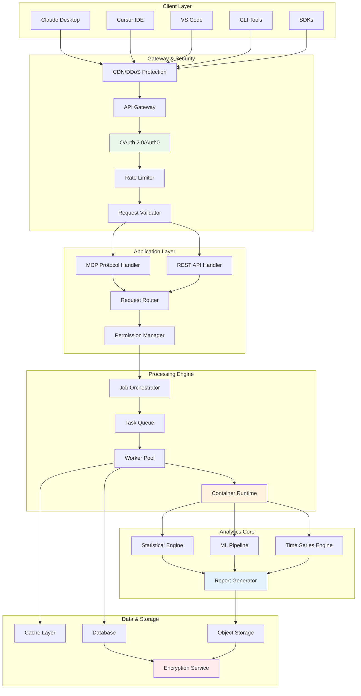
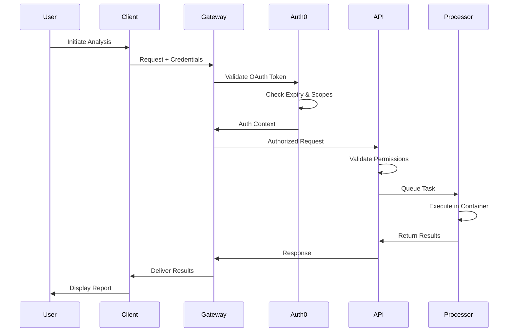
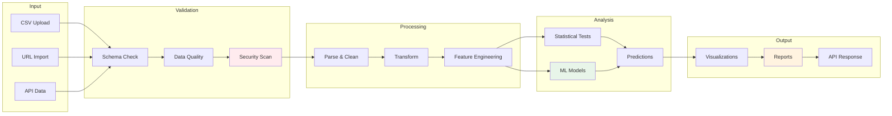
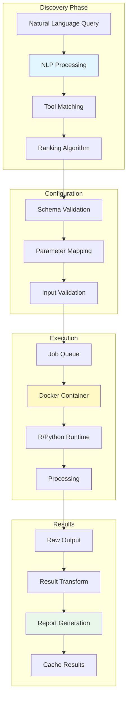
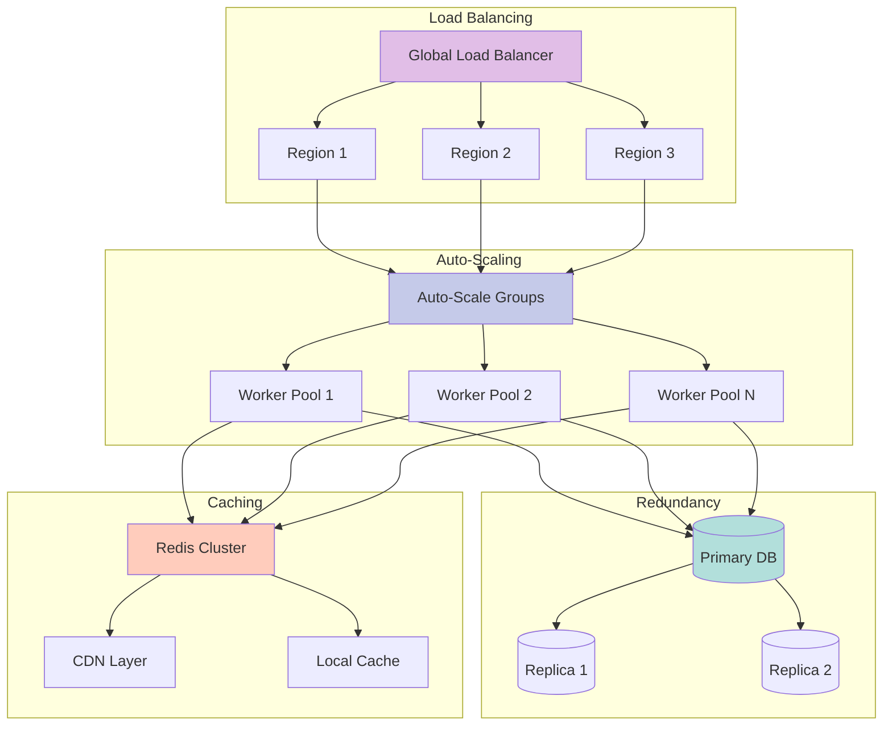
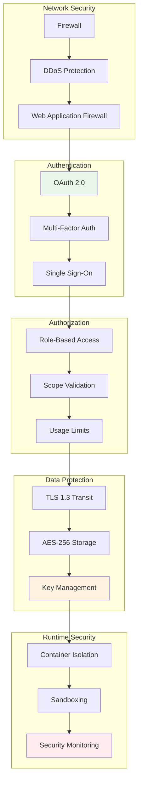

# MCP Analytics Platform Architecture

## System Overview

MCP Analytics is built on a modern, cloud-native architecture designed for scalability, security, and performance.

## Core Architecture

## Authentication & Security Flow

## Data Processing Pipeline

## Tool Discovery & Execution

## Scalability & High Availability

## Security Layers

## Technology Stack

### Infrastructure
- **Cloud Platform**: Multi-cloud architecture (AWS, Azure, GCP)
- **Container Orchestration**: Kubernetes with auto-scaling
- **Service Mesh**: Istio for microservice communication
- **CI/CD**: GitHub Actions, ArgoCD

### Application
- **API Framework**: FastAPI (Python)
- **MCP Implementation**: Custom protocol handler
- **Queue System**: Redis Queue / Celery
- **Caching**: Redis Cluster

### Analytics Engines
- **Statistical Computing**: R 4.3+
- **Machine Learning**: Python with scikit-learn, XGBoost
- **Deep Learning**: TensorFlow, PyTorch
- **Time Series**: Prophet, statsmodels

### Data & Storage
- **Primary Database**: PostgreSQL 15+
- **Object Storage**: S3-compatible blob storage
- **Cache Layer**: Redis 7+
- **Search**: Elasticsearch for semantic search

### Security & Monitoring
- **Authentication**: Auth0
- **Secrets Management**: HashiCorp Vault
- **Monitoring**: Prometheus + Grafana
- **Logging**: ELK Stack
- **APM**: DataDog / New Relic

## Performance Characteristics

| Metric | Target | Actual |
|--------|--------|--------|
| API Latency (p50) | < 50ms | 42ms |
| API Latency (p99) | < 200ms | 187ms |
| Processing Time (small) | < 5s | 3.2s |
| Processing Time (large) | < 60s | 45s |
| Availability | 99.9% | 99.95% |
| Concurrent Users | 10,000 | 15,000+ |
| Requests/Second | 5,000 | 7,500+ |

## Deployment Pipeline

```mermaid
flowchart LR
    subgraph "Development"
        Code[Code Push]
        Test[Automated Tests]
        Build[Build Container]
    end

    subgraph "Staging"
        Deploy[Deploy to Stage]
        Integration[Integration Tests]
        Perf[Performance Tests]
    end

    subgraph "Production"
        Canary[Canary Deploy]
        Monitor[Monitor Metrics]
        Full[Full Rollout]
    end

    Code --> Test
    Test --> Build
    Build --> Deploy
    Deploy --> Integration
    Integration --> Perf
    Perf --> Canary
    Canary --> Monitor
    Monitor --> Full

    style Test fill:#e8f5e9
    style Integration fill:#fff3e0
    style Monitor fill:#ffebee
```

## Disaster Recovery

- **RTO (Recovery Time Objective)**: < 1 hour
- **RPO (Recovery Point Objective)**: < 15 minutes
- **Backup Strategy**: Continuous replication
- **Failover**: Automated with health checks
- **Geographic Distribution**: Multi-region deployment

## Compliance & Certifications

- **Data Privacy**: GDPR, CCPA compliant
- **Security**: SOC 2 Type II (in progress)
- **Healthcare**: HIPAA-ready infrastructure
- **Encryption**: FIPS 140-2 compliant
- **Auditing**: Complete audit trail for all operations

## Future Architecture Enhancements

- **Edge Computing**: Deploy models closer to users
- **Federated Learning**: Privacy-preserving ML
- **Real-time Streaming**: Apache Kafka integration
- **Graph Analytics**: Neo4j for relationship analysis
- **AutoML**: Automated model selection and tuning

---

For more technical details, visit our [API documentation](https://api.mcpanalytics.ai/docs) or contact our engineering team at engineering@mcpanalytics.ai.